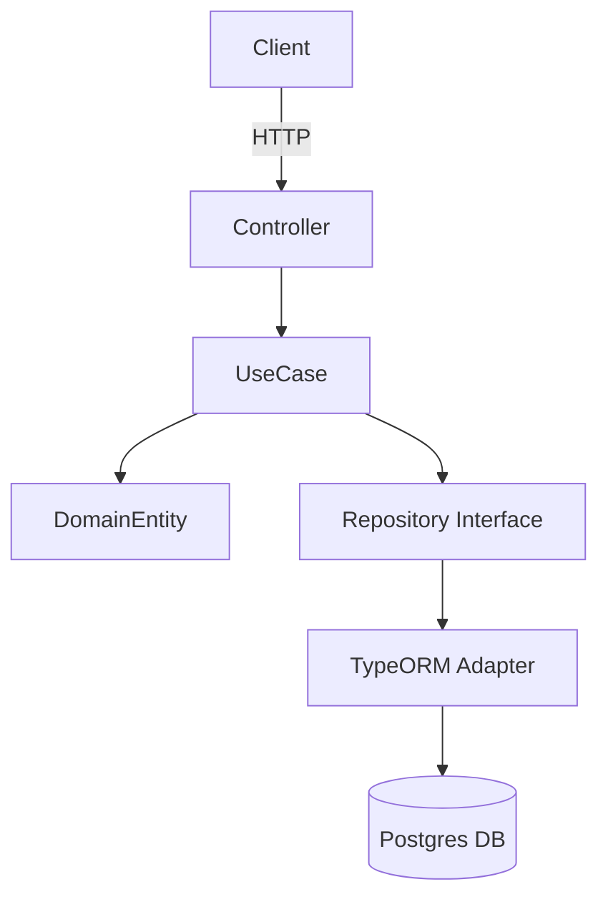

# DOCUMENTATION

## 1. Présentation

Projet : **Express e-commerce API** (TypeScript + TypeORM + PostgreSQL)
But : API back-end organisée en slices (feature-based / DDD) pour gérer produits, commandes, etc.

---

## 2. Résumé rapide (1 ligne)

API modulaire suivant DDD & Clean Architecture : controllers → use cases → repositories → TypeORM adapters.

---

## 3. Architecture globale

* **Layers** : Controllers (HTTP) → Use Cases (application) → Domain Entities → Repositories (ports) → TypeORM (adapters).
* **Organisation** : `src/module/{domain}/{useCase}/` contient Controller, UseCase, Repository interface, TypeOrmRepository, tests.

### Diagramme (Mermaid)



---

## 4. Règles d'architecture importantes

* Use cases dépendent d'interfaces (ports), pas d'implémentations.
* Domain entities contiennent la logique métier (validation dans les constructors / méthodes).
* Repositories spécifiques par use-case (interface au niveau du cas d'usage).
* `entitySkipConstructor: true` dans TypeORM config pour entités avec constructeur.
* `synchronize: true` en dev uniquement.

---

## 5. Qualité du code & bonnes pratiques

* Respecter SOLID : extra attention à l'inversion de dépendance (interfaces pour repositories).
* Pas de logique métier dans les controllers : seulement orchestration et mapping HTTP ↔ DTO.
* Tests unitaires ciblant les use cases avec des doubles (dummy/mocks qui implémentent les interfaces).
* Favoriser petits modules (vertical slices) pour limiter le blast radius des changements.

### Recommandations rapides (prioritaires)

1. Ajouter des tests pour les branches manquantes dans `product/updateProduct`. (cf coverage actuelle)
2. Vérifier indexation DB pour colonnes fréquemment filtrées (optimisation TypeORM).
3. Centraliser la configuration des erreurs pour responses cohérentes `{message: string}`.

---

## 6. Tests (stratégie et commandes)

* **Unit tests** : Jest, fichiers `*.spec.ts` à côté des use cases. Utiliser des doubles d'interface.
* **E2E tests** : `*.e2e.spec.ts` utilisant `@testcontainers/postgresql` + Supertest.

### Commandes utiles

```bash
npm install
npm run dev      # démarrer en dev
npm test         # lancer jest (watch)
jest --config ./jest.config.js  # run once
```

### Structure des tests

* Unit : `src/module/.../{useCase}.spec.ts` (Given / When / Then en commentaires FR)
* E2E : `src/module/.../{useCase}.e2e.spec.ts` -> démarre container Postgres, remplace AppDataSource, buildApp(), supertest

---

## 7. Endpoints (extraits représentatifs)

> Il s'agit d'un résumé — consulter les controllers pour la liste complète.

* `POST /api/product` — créer produit (body: `{title, description, price}`)
* `PUT /api/product/:id` — mettre à jour produit
* `GET /api/health` — health-check

Exemples curl (création) :

```bash
curl -X POST http://localhost:3000/api/product \
  -H "Content-Type: application/json" \
  -d '{"title":"Chaise","description":"Confort","price":49.9}'
```

---

## 8. Environnement & configuration

* **Fichier attendu pour la doc** : `.env` (liste des variables nécessaires)
* **Ne pas inclure** : `.env.local` (ce fichier contient des secrets locaux et ne doit pas apparaître dans la documentation).

Variables typiques à documenter dans `.env` :

```
PORT=3000
DB_HOST=localhost
DB_PORT=5432
DB_USER=xxxx
DB_PW=xxxx
DB_NAME=xxxx
API_TOKEN=...
```

> Ne committez JAMAIS les secrets réels dans le repo.

---

## 9. Lancement local (quickstart)

1. Copier `.env.example` → `.env` et remplir.
2. `docker compose --env-file .env up` pour démarrer Postgres (ou config locale appropriée).
3. `npm install`
4. `npm run dev`
5. Vérifier `GET /api/health` → 200

---

## 10. Qualité & CI recommandés

* Ajouter job CI : `npm test` (unit + coverage), linting, build.
* Vérifier coverage minimal (ex. 80%) et alerter sur régressions.
* Linter + formatter (prettier) en pre-commit.

---

## 11. Points de vigilance (short list)

* Eviter `synchronize: true` en prod.
* Vérifier `entitySkipConstructor` effets sur sérialisation.
* Review des messages d'erreur (FR) et cohérence.

---

## 12. Où chercher dans le repo

* `CLAUDE.md` : overview d'architecture et conventions (source primaire pour Claude agents)
* `src/module/*` : use cases, controllers, repositories
* `coverage/` : rapport de couverture (pointer sur `product/updateProduct` pour amélioration)


