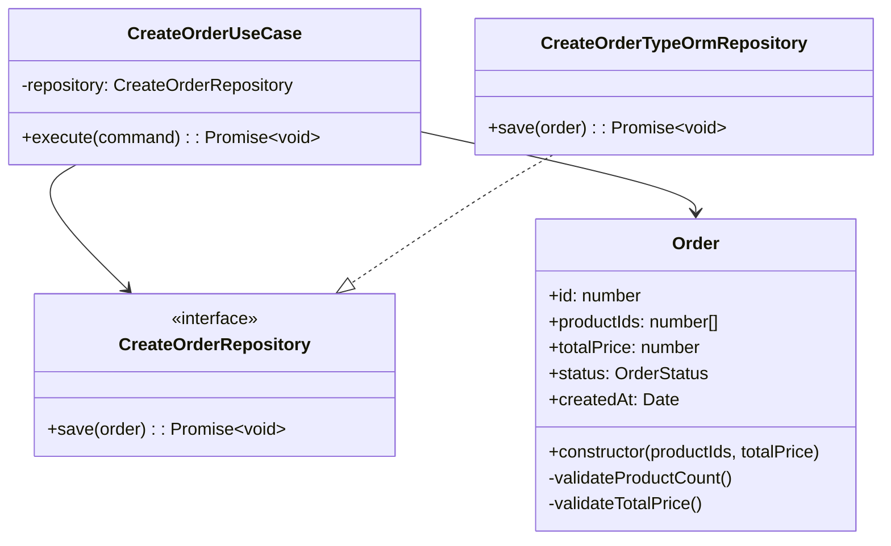

# Module Order - Documentation

## Vue d'ensemble

Le module `Order` gère la création et la gestion des commandes dans l'API e-commerce. Il suit les mêmes principes d'architecture que le reste du projet : **Domain-Driven Design (DDD)** et **Clean Architecture**.

---

## Architecture & Organisation

### Structure des fichiers

```
src/module/order/
├── Order.ts                  
└── createOrder/
    ├── createOrderController.ts        
    ├── createOrderUseCase.ts            
    ├── createOrderRepository.ts                
    ├── createOrderTypeOrmRepository.ts 

```

### Flux de données

```
Controller → UseCase → Domain Entity → Repository Interface → TypeORM Adapter → Database
```

---

## Principes d'architecture appliqués

### 1. **Inversion de dépendance (SOLID - D)**
- Le `UseCase` dépend d'une **interface** `CreateOrderRepository`, pas d'une implémentation concrète
- L'adaptateur TypeORM implémente cette interface
- Facilite les tests avec des doubles (mocks/dummies)

### 2. **Entité de domaine riche**
- La classe `Order` contient la **logique métier** :
  - Validation du nombre de produits (1-5)
  - Validation du prix total (2€ - 500€)
  - Génération automatique du statut (`PENDING`) et de la date
- Constructeur avec validation → **impossible de créer une commande invalide**

### 3. **Separation of Concerns**
- **Controller** : gère HTTP (requête/réponse, status codes)
- **UseCase** : orchestre l'opération (crée l'entité, appelle le repository)
- **Entity** : encapsule les règles métier
- **Repository** : abstraction de la persistance

---

## Règles métier (Business Rules)

### Contraintes de commande
| Règle | Valeur | Message d'erreur |
|-------|--------|------------------|
| Nb min de produits | 1 | "La commande doit contenir au moins 1 produit" |
| Nb max de produits | 5 | "La commande ne peut pas contenir plus de 5 produits" |
| Prix minimum | 2€ | "Le prix total doit être d'au moins 2€" |
| Prix maximum | 500€ | "Le prix total ne peut pas dépasser 500€" |


### Valeurs par défaut
- **Statut initial** : `PENDING` (généré automatiquement)
- **Date de création** : timestamp actuel (via `@CreateDateColumn`)

---

## Conventions de code

### Nommage
- **Entités** : PascalCase singulier (`Order`)
- **Use cases** : `{Action}{Entity}UseCase` (`CreateOrderUseCase`)
- **Repositories** : Interface = `{Action}{Entity}Repository`, Implémentation = `{Action}{Entity}TypeOrmRepository`
- **Controllers** : `{action}{Entity}Controller.ts`

### TypeScript
- Types stricts activés (`strict: true`)
- Pas de `any` implicite
- Interfaces explicites pour les contrats

### Tests
- **Unitaires** : doubles de test (dummy/mock) pour isoler le use case
- **E2E** : conteneur PostgreSQL réel via `@testcontainers`
- Structure **Given-When-Then** avec commentaires en français

---

## Exemple d'utilisation

### Requête HTTP valide
```http
POST /api/order
Content-Type: application/json

{
  "productIds": [1, 2, 3],
  "totalPrice": 150.50
}
```

### Réponse succès
```json
HTTP/1.1 201 Created
```

### Réponse erreur
```json
HTTP/1.1 400 Bad Request
{
  "message": "La commande ne peut pas contenir plus de 5 produits"
}
```

---

## Points d'attention

1. **Validation en deux temps** :
   - UseCase valide les données entrantes
   - Entity valide les règles métier dans le constructeur

2. **Configuration TypeORM** :
   - `entitySkipConstructor: true` obligatoire (car constructeur avec logique)
   - `synchronize: true` en dev uniquement

3. **Gestion d'erreurs** :
   - Erreurs métier → `400 Bad Request`
   - Erreurs techniques → `500 Internal Server Error`

---

## Évolutions futures recommandées

- [ ] Calculer `totalPrice` automatiquement à partir des IDs produits
- [ ] Ajouter une table `OrderItem` pour la relation N-N avec `Product`
- [ ] Implémenter des transitions d'état (`PENDING` → `CONFIRMED` → `SHIPPED`...)
- [ ] Ajouter des tests pour les erreurs de sauvegarde en base

---

## Diagramme de classes simplifié

